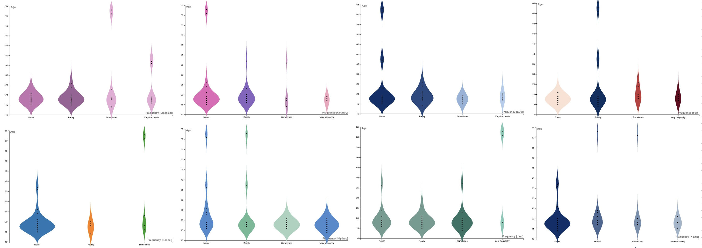

# Jasreen-Mander-Final-Research-Project
 This is research project that highlights mental health and its relation with music therapy
 
## Using Data Visualization to Examine the Relationship between Music and Mental Health 

# Abstract
This report examines the connection between music and mental health, it involved finding a dataset on Kaggle that included details about musical genres, mental health, and listening preferences. To determine how music therapy benefited the mental health of young participants and which musical genres and listening behaviours had the most impact, the data was entered into the data visualisation program RAW Graphs. The study established relationships between music listening behaviours, mental health issues, age and music preference using a variety of graph formats. The study also looked at music therapy, and the important concepts and terms revealed in the research were identified using Voyant. 

# Introduction
Mental health in recent times has become an important topic of discussion especially for the younger generations, as a result professionals have had to investigate various therapy methods to treat these mental illnesses that affect an individual’s life socially, academically, and professionally. One method that has been used is music therapy, which involves using music to improve an individual’s mental health. This report explores the relation between music therapy and mental health issues such as anxiety, depression, insomnia, and OCD. This is done by utilizing a dataset that presents the result of a survey in which individuals answered questions regarding their mental health and effects of music therapy. To present the results of the chosen dataset and research conducted on music therapy, this report uses [RAW Graphs](https://www.rawgraphs.io/), a free open access digital tool that visualizes data. Along with a web-based reading and analysing platform for digitised texts called [Voyant Tools](https://voyant-tools.org/). Visualizing data can help in understanding underlying issues and results that are not apparent from simply reading a dataset, this data in particular can be visualized using a humanistic approach as it uses qualitive expressions such as listening preferences and effects of mental health and music therapy. Humanistic approach when used to gain knowledge embraces qualitative expressions and recognizes the importance of knowledge that is interpretive (Drucker, 2011)[2](2). Using digital tools such as Voyant, a text analysis tool, to present research can show new ways to analyze and interpret data, since it refines the shared methodological approach that defines digital humanities, rather than a particular set of text and technology (Fisher)[3](3). By studying music therapy and mental health this report aims to explore how music can be used as a method of therapy to handle the effects of mental health amongst the younger generations based on the genre of music, frequency of listening to each genre along with listening habits. Also by exploring age related factors such as what mental health issues younger generations face, the effectiveness of music therapy and musical preferences, a thorough understanding of how music therapy may be used to enhance young people's mental health can be created.

# Methods
The first step in the process was finding a dataset that can be used to demonstrate the relationship between music and mental health. By searching sites such as Kaggle a dataset pertaining to the topic of this report was found. The data is split into three sections, background, music genres, and mental health (Rasgaitis, 2022)[9](9). The first section, background, contained answers to questions regarding: 
-  The participant's music taste
-  Preferred streaming platform.
-  Number of hours they listen to music.
-  Whether they listen to music while working
-  If they play an instrument or compose music themselves
-  If they explore different genres and music of different language

In the music genre section, participants indicated how frequently they listened to various musical genres, with response options including never, rarely, sometimes and very frequently. The mental health section contained ratings from 0-10 for the frequency of occurrence for anxiety, depression, insomnia, OCD, and music effects (the influence of music therapy on mental health). For music effects the ranking was done by stating whether their mental had no effect, improved, or worsened. After determining how to interpret the data, it was put into a data visualization tool. Since this report is interested in seeing how music therapy helped in improving the young participant's mental health and what genre or listening habit had the most effect, the tool chosen to visualize the data was RAW Graphs. A violin plot was made to show the correlation between the age variable and the variables present within the music genre section, hence determining what each age group tends to listen to more. Then by making a contour plot, we can determine the relationship between the age groups and the different mental health issues, thus showing what issues are more prominent among young adults. Also, by comparing the age groups to the effects of music therapy by making a sunburst diagram a relation between how effective music therapy is for young adults can be made. Further correlation to see if a certain musical style is more suited to addressing an issue was made. This was done using a stacked bar graph to compare the ratings for each mental health condition and the frequency of listening to each music genre. Next, visualizing the number of hours spent listening to music, and if music is played while working, whether they play an instrument or make music, and the ratings for each mental health issue using a radar chart will help establish a correlation between music listening habits and mental health issues. This determines whether there is a certain music-listening habit that is more successful at addressing mental health conditions. This step was repeated but a correlation was made between music listening habits and music therapy using an alluvial diagram. This would determine whether there is a certain listening habit that enhances the effectiveness of music therapy. After creating the different visuals, the next step was to research music therapy itself, doing so will allow for the reasoning behind the interpretations made after determining the results. The research found through this step was put into Voyant for the purpose of seeing the key idea and words found within the research conducted.

# Result
## Music Genre vs Mental Health 

The comparison of music genre to mental health issues showed interesting results for anxiety, depression, OCD, and insomnia. Those who never or rarely listened to certain genres, such as country, folk, gospel, and classical music, had the highest occurrences of anxiety and depression, while those who listened to classical, EDM, folk, jazz, Latin, Lofi, and video game music frequently had the lowest occurrences of anxiety and depression. On the other hand, OCD was highest among those who rarely listened to classical, never, and rarely listened to country, EDM, Latin, and metal music. The lowest occurrences of OCD were reported by those who listened to classical and EDM very frequently, country sometimes and very frequently, jazz and video game music. Also was lowest for those who reported rarely listening to k-pop, Latin, lofi, metal, R&B, rap, and rock. Additionally, those who rarely listened to classical music and EDM, never or rarely listened to country music, and never, rarely, or sometimes listened to folk and jazz music, reported having the most insomnia. Along with those who sometimes listened to hip hop, and never listened to K-pop, Latin, lo-fi, gospel and metal music, In contrast, those who listened to classical music sometimes and frequently listened to country, EDM, folk, jazz, Latin, lo-fi, metal, R&B, and video game music, had the least insomnia. Along with those who never listened to hip hop, rarely or sometimes listened to gospel and rock music, and sometimes or frequently listened to K-pop. 

## Age vs Genre

From the graphs above it is evident that majority of the participants age range from 15 to 20, when examining to see which genre participants of this age group listen to the most, it is clear to see rock, rap, pop, hip-hop are listened to more frequently amongst them. In contrast the other genres have been voted to be sometimes, rarely, or never listened to amongst people aged 15-20. The graphs also show the few participants from the selected sample that were above 20, amongst them rock and classical were very frequently listened to in comparison to the genres that were listened to sometimes, rarely, or never.

## Age vs Mental Health 

[from left to right: Anxiety, Depression, Insomnia and OCD] These four graphs when looked at show the age of the participants in correlation to the four mental health issues being looked at in this dataset. From these graphs it is evident to see that participants under 20 experience issues related to depression, anxiety, insomnia, and OCD. Depression, anxiety, and insomnia were denser with the density of occurrences ranging from 1 to 10 while OCD was less dense with the density of occurrences ranging from 1 to 5. Other age groups are also evident on the graphs but show less occurrences of the four issues.

## Listening Habits vs Mental Health  

[from left to right: Composing vs Mental health, Playing Instrument vs Mental health, Listening while working vs Mental health] In the three graphs we can see that different musical habits of each of the participants all closely effected the ratings given for mental health occurrences. Those who said no to composing music all had answers ranging from 1 to 10 for the four issues, the same for those who said yes. This was the same result for those who said yes and no to playing an instrument. For those who said yes to listening to music while working all had answers ranging from 1 to 10 for the four issues and this was the same for those who said no, except for OCD which has a lower range in comparison to the other issues.   

 ## Time vs Mental health 
 
These last graphs show the different number of hours spent listening to music and the correlation it has with the answers received for the different mental health issues. The results for this were organized in the table below. 

## Listening Habits vs Mental effect

This graph shows the different music listening habits in comparison to effects of music therapy by looking at this visual we can see the varying answers of the participants in a hierarchal structure. While they differentiate a lot, ultimately majority of the participants found the effects of music therapy to have improved their mental health with a few others finding it to not be effective or instead worsen their condition.

## Age vs Mental Effect

This graph shows the age of the participants and how effective the age groups found music therapy to be, it is evident that a big portion of the chart shows that music therapy improved the conditions for all age groups, however there were still a few participants from the different age groups that found it to be not effective or worsen their conditions. 

## Voyant Results

# Discussion 
When examining the results of the graphs that show the relation between the frequency of the four mental health issues with the sixteen different genres of music it was evident that the answers for which music genres affect each mental health varied heavily when examining the high and low frequency of the issues. But when looking at the genres that correlated with a low frequency for all four issues the commons ones appeared to be classical, jazz, EDM and video game music. Seeing how many of the participants that experienced these mental health issues ranged from ages 15-20, the common occurrence of video game music was not surprising since video games are widely accepted by young people and this increase of use was seen during the Pandemic especially since traditional ways of therapy were compromised, and so video games had become a more widely used method of therapy by young people (Hazel, Min Kim, & Every-Palmer, 2022)[5](5). Similarly, the reoccurrence of classical music appearing in the result for each mental health issues can be due to classical music being relaxing and the tons of research on music therapy that shows classical music to have significant impact on reducing stress and anxiety (Gomes et al., 2023)[4](4) since stress is associated with anxiety, it also improves quality of sleep majorly (Rahman et al., 2021)[7](7). Seeing classical being a reoccurring genre amongst the age group was surprising, because when researching the preference of young people in comparison to older it was concluded that older people tend to prefer relaxing music such as classical, jazz, folk, and blues genres (Clark, 2015)[1](1). Younger people however prefer intense and rebellious music such as rock, alternative, and heavy metal genres(Clark, 2015)[1](1). Another common factor amongst the results was how regardless of the genre, listening to music frequently or even sometimes showed less frequency of occurrences for anxiety, depression, insomnia, and OCD. This is because music has been proven to be an effective stimuli for therapy since music enhances the brains cognitive ability, focus and memory formation by increasing the gamma waves in the brain (Rahman et al., 2021)[7](7). The listening habits of each participants showed varying answers for composing music, playing an instrument and listening while working regardless if they said yes or no to performing these actions. 
> There is a significantly high risk of having anxiety amongst those who play an instrument compared to those who never played an instrument due to the cognitive and physical process attached, Active amateur musicians report much better self-reported health than non-musicians, whereas active professional musicians reported significantly more overall wellness concerns (Wesseldijk et al., 2019)[8](8). 

Although the study's findings on the connection between musical styles and mental health problems are intriguing, there are several limitations that need to be noted. The limitations include:
1. The research relied on self-reported data, which isn't always precise or trustworthy. It's possible that participants misinterpreted the questions or gave conventional answers.
2. The study only looked at how four mental health conditions and sixteen musical genres related to one another. Other music genres or mental health conditions that were not considered could have produced different outcomes. 
3. The research's sample size, which was only 50 people, is another drawback, since a larger sample could’ve revealed different outcomes or more detailed outcomes. 
4. Additionally, despite the noteworthy research, the subject of music therapy for mental health is still very undeveloped and has limited research articles that could have been used to describe the results of OCD, number of hours spent listening to music, the effect of EDM and jazz music, listening to music while working and lastly since younger generations prefer rock, rap, pop, hip-hop research on how they can be effective in music therapy can be done as well. 

Due to this, further research needs to be conducted to completely understand the connection between music and mental health, further research especially in digital humanities can help in facilitating conversations that can help individuals through difficult experiences using methods, principles, and subjects of the humanities  (Kirschenbaum)[6](6). In conclusion, these findings can be used by professionals to create an basic structure for music therapy focused on young individuals by incorporating genres such as classical, jazz, EDM and video game music, and listening frequently. Even though composing music and playing instrument showed higher risks of anxiety they can still incorporated safely with an effective learning plan in place, these results can also be a basis of future research.

# References
#### 1 
Clark, S. (2015). Toward Predicting Prosocial Behavior: Music Preference and Empathy Differences Between Late Adolescents and Adults. Empirical Musicology Review, 10(1), 1-16.https://doi.org/10.18061/emr.v10i1-2.4602
#### 2
Drucker, J. (2011). Humanities Approaches to Graphical Display. DHQ: Digital Humanities Quarterly, 5(1).http://www.digitalhumanities.org/dhq/vol/5/1/000091/000091.html
#### 3
Fisher, D. (n.d.). Goals of the Publicly Engaged Humanities. Humanities for All. https://humanitiesforall.org/essays/goals-of-the-publicly-engaged-humanities
#### 4
Gomes Arrulo, T., Doumas, M., & A. Papageorgiou, K. (2023). Beneath the surface: The influence of music and the dark triad traits on stress and performance. Current Psychology, 42, 3076–3090.https://doi-org.proxy.library.brocku.ca/10.1007/s12144-021-01664-0
#### 5
Hazel, J., Min Kim, H., & Every-Palmer, S. (2022, August 4). Exploring the possible mental health and wellbeing benefits of video games for adult players: A cross-sectional study. Australasian Psychiatry, 30(4), 541-546.https://doi-org.proxy.library.brocku.ca/10.1177/10398562221103081
#### 6
Kirschenbaum, M. (n.d.). What Is Digital Humanities and What’s It Doing in English Departments? Debates in the Digital Humanities, 1(1).https://dhdebates.gc.cuny.edu/read/untitled-88c11800-9446-469b-a3be-3fdb36bfbd1e/section/f5640d43-b8eb-4d49-bc4b-eb31a16f3d06
#### 7
Sharmin Rahman, J., Gedeon, T., Caldwell, S., Jones, R., & Jin, Z. (2021). Towards Effective Music Therapy for Mental Health Care Using Machine Learning Tools: Human Affective Reasoning and Music Genres. Sciendo, 11(1), 5-20. https://doi.org/10.2478/jaiscr-2021-0001
#### 8
W.Wesseldijk, L., Ullén, F., & A. Mosing, M. (2019). The efects of playing music on mental health outcomes. Scientifc Reports, 1-9.| https://doi.org/10.1038/s41598-019-49099-9
#### 9
Rasgaitis, C. (2022, November). Music and Mental Health Survey. https://www.kaggle.com/datasets/catherinerasgaitis/mxmh-survey-results?resource=download

